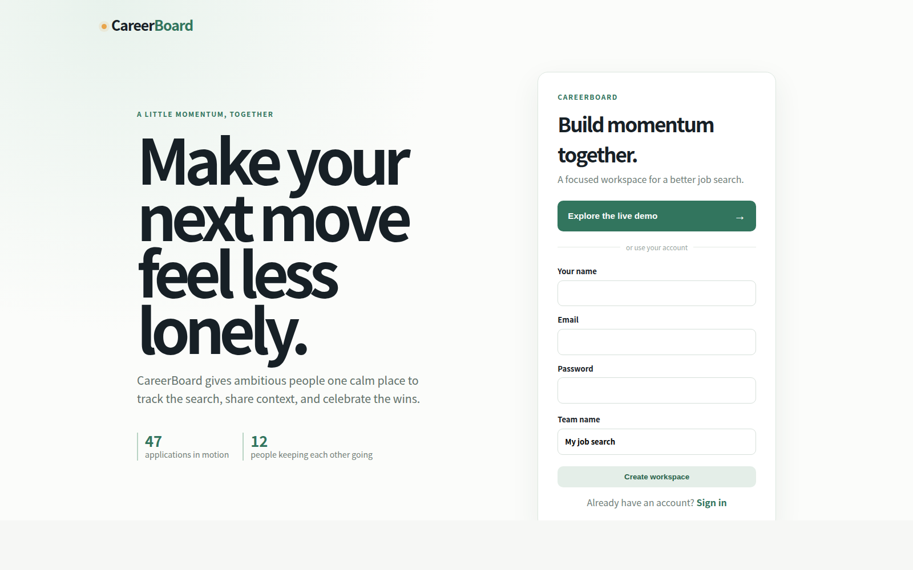
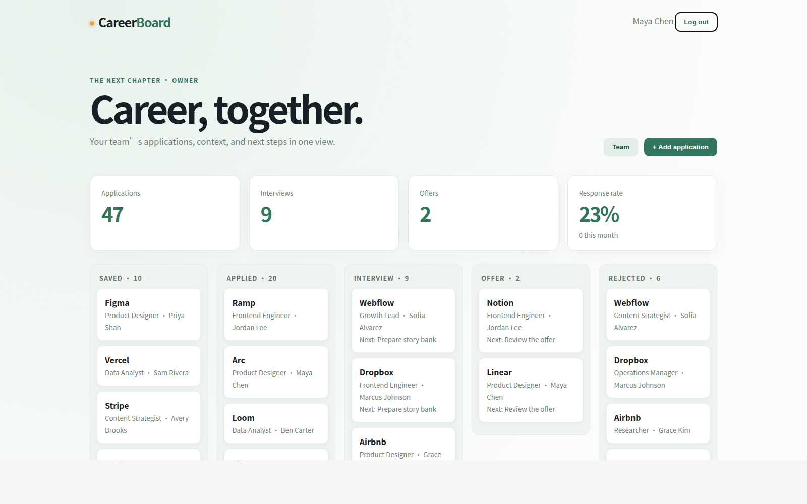

# CareerBoard

CareerBoard is a multi-tenant collaborative job-search workspace for career groups. Owners and admins invite members, members manage their own applications, and the whole team can collaborate through comments, activity history, interviews, and analytics.

> Collaborative job-search workspace for career groups: track applications, interviews, team activity, and shared job-search intelligence.

## Included

- Password authentication with expiring, revocable signed tokens
- Owner/admin/member authorization checked against team membership on every route
- Relational SQLite model: users, teams, memberships, invitations, companies, jobs, applications, comments, interviews, activity, and analytics events
- JSON API for collaboration, applications, comments, interviews, health, readiness, and analytics
- Durable SQLite job queue with an in-process worker for in-app comment and interview notifications
- Security headers, request-size limits, rate limiting, validation, and structured error logging
- GitHub Actions CI for checks, tests, dependency audit, and Docker builds
- Docker deployment configuration with `/api/health` and `/api/ready` probes
- Product UI with a persistent search/team shell, application board, detail workspaces, activity, notifications, people, companies, analytics, onboarding, shortcuts, themes, and mobile navigation

## Run locally

```bash
npm install
cp .env.example .env
npm start
```

Open http://localhost:3000. For production, set a strong `JWT_SECRET`, put SQLite on a persistent volume, and monitor `/api/health` and `/api/ready`. The event table is intentionally simple so it can later be replaced with PostHog or another analytics provider without changing the UI contract.

## Live demo

Open [the live demo](http://localhost:3000/?demo=1) after starting the app. One click provisions a realistic, read/write workspace called **The Next Chapter** with 12 members, 47 applications, 18 companies, 9 interviews, and 2 offers.

The demo is deterministic and safe to run repeatedly. It uses local `@careerboard.local` accounts and does not require an email inbox. For a fresh database, the same flow is available from the **Explore the live demo** button on the sign-in screen.

## Product tour





The dashboard is the starting point for the application board, team members, comments, interviews, activity history, and analytics summary. Click any application to explore its shared context and comments.
